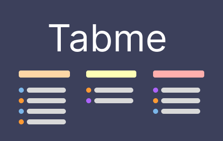

# Tabme — [Chrome Extension](https://chromewebstore.google.com/detail/tabme/jnhiookaaldadiimlgncedhkpmhlmmip)


<br>
<br>
### Organize Bookmarks and Tabs, Done Right
- [Install in Chrome Store](https://chromewebstore.google.com/detail/tabme/jnhiookaaldadiimlgncedhkpmhlmmip)
- [gettabme.com](https://gettabme.com)
- [Release changelog](https://gettabme.com)


## Includes the following

* TypeScript
* Webpack
* React
* Jest

## Setup

```
npm install
```


## Build

```
npm run build
```

## Build in watch mode

```
npm run watch
```

## Load extension to chrome

Load `dist` directory

## Test
`npx jest` or `npm run test`

## publish
1) Update "version" in `manifest.json` file
2) build using `npm run build`
2) go `/dist` 
3) run `zip -r dist.zip *`
4) Add archive with correct version into "builds" folder and commit it
5) Upload update in the ChromeStore admin panel
NOTE: Dont forget update "What's new"
